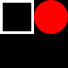
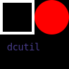

# dcutil
A simple image editor bot for [Discord](https://discord.com) based on [Discord.js](https://discord.js.org) and [Canvas](https://github.com/Automattic/node-canvas/).
* [Invite Link](https://discord.com/oauth2/authorize?client_id=715447131883962419&scope=bot&permissions=52224)
* [Command List](commands.md)


## Functionality
What dcutil can do:
* create new images
* get user avatars
* resize images
* paste images over images
* write text to images
* draw shapes to images
* crop and add borders to images

What dcutil can't do:
* meme generation without your own templates
* add effects to images (check out [NotSoBot](https://discord.com/oauth2/authorize?client_id=439205512425504771&scope=bot) for that)
* live up to people's expectations


## Example
* `_color black`
* `_new`


* `_color white`
* `_rect 2 2 46 46 4`


* `_color red`
* `_circle 50 0 50 50`


* `_color darkslateblue`
* `_text 10 60 14 monospace`
* `dcutil`



## Self-hosting
1. Clone the repository.
2. Install the dependencies. `npm i discord.js canvas`
3. Create a config.json in the root directory. Here you can change various variables of the bot, but the most important are the token and prefix.
```json
{
	"token": "bot token here",
	"prefix": "prefix here, default is _",
	"successEmoji": "✅",
	"errorEmoji": "❌",
	"editEmoji": "✏",
	"helpEmoji": "❔",
	"linkEmoji": "🔗",
	"embedSuccessColor": 7844437,
	"embedFailColor": 14495300,
	"embedEditColor": 16763981,
	"embedDefaultColor": 8952230,
	"imageLoaderFetchLimit": 25,
	"undoFetchLimit": 10,
	"safeLimitX": 4096,
	"safeLimitY": 4096
}
```
4. Run the bot. `node index.js`